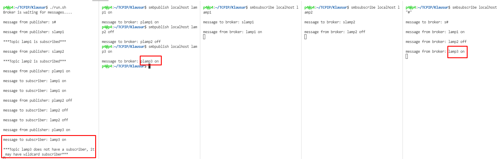

# TCPIP-Programmierung SoSe 2021 – Klausuraufgabe - smb – Simple Message Broker

## Contents

* [Task](#task)
* [Structure](#structure)
* [Environment](#prepare-the-environment)
* [Usage](#usage)
* [Broker Implementation](#broker-implementation)
* [Publisher Implementation](#publisher-implementation)
* [Subscriber Implementation](#subscriber-implementation)

## Task

This exam project focuses on developing simple message broker architecture. A `message` consists
the tuple `topic` (subject) and `message` (value, content), where
topic and message are to be implemented as simple `strings`. If the
hashtag `#` is used as topic, all messages are forwarded from the `broker` to the
`subscriber`. The broker does not store the messages but forwards a message only if the topic has been subscribed to by a subscriber. Subscriber has subscribed to it. The communication between broker and publisher or broker and subscriber is done via  `UDP`.

## Structure


### Broker

* mediator of news
* reads message from publisher
* manages message
* sends message to subscriber

### Publisher

* creator / sender of message
* generates data and sends message to Broker
* message consists of topic and data

### Subscriber

* consumer / receiver of message
* connects to Broker and subscribes to Topic
* reads message from broker for further processing

## Prepare the environment

### Compilation smbbroker.c

run this in bash before using:

```bash
gcc smbbroker.c -o smbbroker
sudo cp smbbroker /usr/local/bin
 ```

### Compilation smbpublish.c

run this in bash before using:

```bash
gcc smbpublish.c -o smbpublish
sudo cp smbpublish /usr/local/bin
 ```

### Compilation smbsubscribe.c

run this in bash before using:

```bash
gcc smbsubscribe.c -o smbsubscribe
sudo cp smbsubscribe /usr/local/bin
 ```

## Usage 

Broker should be always up:

Run this:

```bash
smbbroker
 ```

`Subscriber` should have one topic and it should be also up.

Run this in another terminal to `subscribe lamp1`:

```bash
smbsubscribe localhost lamp1
 ```

Note that, you can have multiple subscribers.

Run this in another terminal to `subscribe lamp2`:

```bash
smbsubscribe localhost lamp2
 ```

`Subscriber` can also have `wildcard`. It means it receives all messages from `Broker`.

Run this in new terminal:

```bash
smbsubscribe localhost "#"
 ```

When subscribers are set, it is expected to have 5 terminal as shown below.


Now `Publisher` can send messages to `Broker`. Let's say we want to turn on lamp1

Run this in another terminal

```bash
smbpublish localhost lamp1 on
 ```


As you can see from the result, message is delivered via `Broker` only to `lamp1 Subscriber` and `wildcard Subscriber`.

Let's now turn off lamp2. Run this in `publisher terminal`:

```bash
smbpublish localhost lamp2 off
 ```


As you can see from the result, message is delivered via `Broker` only to `lamp2 Subscriber` and `wildcard Subscriber`.

Let's try now to turn off lamp3 which does not exist. Run this in `publisher terminal`:

```bash
smbpublish localhost lamp3 off
 ```



As you can see from the result, message is delivered via `Broker` only to `wildcard Subscriber`.

## Broker Implementation

Broker program is simply implemented. First, socket implementation will be discussed. Then, we will discuss implementation of code when subscriber sends a message. On the other hand, we will go over code when publisher sends a message. Lastly, we will discuss how message is sent to relevant subscriber.

Broker is programmed with the help of socket programming. When program is started, then first thing socket is created. In our case it is AF_INET which specifies that we are using IPv4 Internet-Socket. As a second parameter we use SOCK_DGRAM which basically says that we use UDP. Then, we are binding local address to socket with the help of bind function. Then, in infinite while loop we are waiting for messages from clients(Subscriber or Publisher) and accepting messages with the help of function recvfrom().

When we accept message from client, we have to distinguish which client sent a message to broker. In order to do that, I am introducing a header character which can be either 'p' for Publisher or 's' for Subscriber. This character can be appended when it is sent from source client. For example, when we `smbsubscribe localhost lamp2` in subscriber terminal, then message, which is sent to broker, is actually  `slamp2`. As I mentioned before, 's' stands for subscriber. Therefore, broker first gets first character of the message with `buffer[0]` and checks whether it is `s` or `p`.

In the case of `s`, first broker gets rid of first character with `buffer+1`. Then, we have two types of subscribers: normal subscribers with single topic and wildcard subscribers that receive all messages from broker. First, if it is wildcard subscriber, then we have to check if wildcard subscriber limit is reached. It means, there can not be more than 5 wildcard subscriber. If the limit is not reached, then I need from this subscriber only its `port number` so that i can forward messages later because our environment is LAN. On the other hand, if the message is `topic`, then i am checking whether we have already that topic. If that topic does not have already a subscriber then I am adding `port number` of this client to my linked list with the key being `topic`. My Linked list has two function `insertFirst()` and `find()` that what I exactly need in my program.  First one is used to insert port numbers with topic and other one is to find port numbers with that topic.

In the other case, first character being 'p, we are also getting rid of first character. I could also accomplish this by `buffer+1` as I did in subscriber case. But that approach led me to anomalies, therefore i declared another string and saved there publisher message without the first character. First thing what program does is sending this message to wildcard subscribers. This is easily done with custom function `sendToSubscriber(port)` which requires only `port number` of the client to send the message. So, we got rid of first letter and sent message to wildcard subscribers. Now it is time to discuss about other parts of the message which are `topic` and `value`. So I have to get port number of the client with that topic which is done with `find()` function. It searches for a port number in linked list with the key being topic name. For that we need to parse out the topic. I used `strtok()` for parsing and parsing is defined with `delim[]` which is in my case a whitespace. If topic search from linked list is successful , we will use  custom function to `sendToSubscriber(port)` which is discussed earlier.

## Publisher Implementation

## Subscriber Implementation

This program subscribes to broker with a topic and waits for messages which are directed to this subscriber. Here is worth of discussion two things. First is sending message to broker and secondly, waiting for message. 

So, this client is also programmed with socket programming. It means, all the steps to create socket are same. What is interesting here is how hostname is translated to IP or vice versa. It is done with function `inet_ntoa()`. This program requires 3 arguments. When it is fulfilled then we can start to sent a message to broker. Message is here is only name of the topic. Additionally, we are going to append 's' letter to the message so that broker will know that this message comes from subscriber. The message is sent with the help of `sendto()` function.

Next, program waits for correspondent messages with the help of `recvfrom()` function. When Broker sends a message, subscriber receives the message and saves it to buffer. Then, it outputs that message to the console.